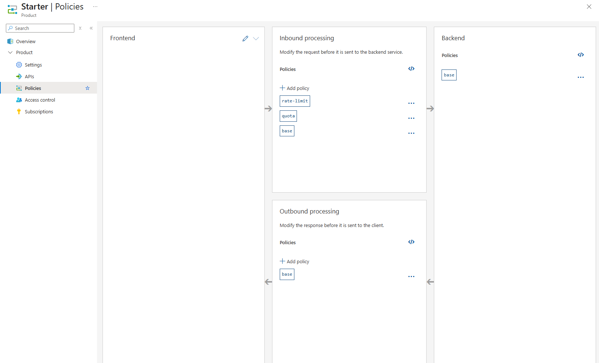
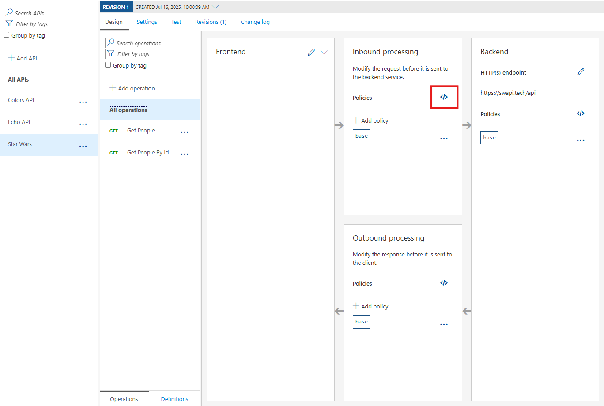

# Azure Integration Services Workshop

## Azure API Management (APIM) – Hands-On Guide

APIM allows organizations to publish and manage APIs at scale, acting as a secure front door to backend services. This hands-on exercise will guide you through creating an API Management instance, adding APIs, adding policies, and testing.

### Skill Objective: API Management

Learn how to create an API gateway, publish a backend service as an API, and apply basic operations and tests using Azure API Management.

### Acknowledgement

This lab is based on the [Azure API Management Hands on Lab](https://azure.github.io/apim-lab/). This hands-on lab will guide you through the different concepts around Azure API Management, from the creation to the DevOps, including good practices in terms of versioning, security, and so on. It is designed to bring customers and partners to a level 200 understanding of Azure Api Management. It is a hands-on lab experience, all instructions are provided, but a basic level of understanding of apis is expected (http operations, networking basics, openapi, rest, soap, oauth2, and other concepts).

## Guide Steps

### Step 1

Create an API Management Service – In the Azure portal, create a new API Management instance. Go to Create a resource > Integration > API Management. Fill in the basics (resource group, service name, region, organization name, admin email, pricing tier) and create the service.

<!-- markdownlint-disable-next-line MD033 -->
Please note that the **service name must be unique** across Azure, as it will be part of the public URL for your API Management instance (e.g., https://<service-name>.azure-api.net).

> The **Pricing tier** is important. For this lab, you can use the **Developer** tier, which is the cheapest and ideal for our hands-on lab. If you want to use the **Standard** or **Premium** tiers, please ensure you have the necessary permissions and budget.
<!-- markdownlint-disable-next-line MD028 -->
> API Management stv2 services can take ~30-60 minutes to deploy, so plan accordingly. Otherwise, using API Management v2 services will take 5 minutes to deploy. However, as there is no **Developer** tier available for v2 services, you will need to use the **Basic** tier which is more expensive than the Developer stv2 tier.


Please do not modify other settings. Specifically, the *Virtual network* tab should remain as **None**.


Once started, it is not necessary to remain on this page or in the Azure Portal. If you entered a valid email address, you will receive a provisioning completion email:


### Step 2

Add a Backend API – Once APIM is running, navigate to your API Management service and select APIs from the left menu.


For this lab you will use the existing [*Star Wars* API](https://swapi.tech/api):

1) Click on **Add API**.  
2) Click on **HTTP - Manually define an HTTP API**.  
3) Select the **Full** option in the **Create an HTTP API** dialog.  
4) Enter **Display name** `Star Wars`, **Name** `star-wars`, and, optionally, **Description**.  
5) Assign `https://swapi.tech/api` to the **Web service URL**.  
6) Keep the **URL scheme** at `HTTPS` as we strive to enforce HTTPS only.  
7) Set the **API URL suffix** to `sw`. This allows us to compartmentalize the Azure API Management URLs for distinct APIs.  
8) Assign **Starter** and **Unlimited** products.  
9) Press **Create**.  

  > While it is conventionally a good idea to version APIs from the onset, we are omitting this step here for brevity of the labs. The [Azure API Management Hands on Lab](https://azure.github.io/apim-lab/) has a specific [lab](https://azure.github.io/apim-lab/apim-lab/5-versions-revisions/) on versioning APIs which you can refer to for more details.


Once created, inside the *Star Wars* API press **+ Add operation** to declare two new operations:

1) **Get People**

- Display name: **Get People**  
- Name will be populate with: **get-people**  
- URL: **GET /people/**  
<!-- markdownlint-disable-next-line MD029 -->
2) **Get People By Id**

- Display name: **Get People By Id**  
- Name will be populate with: **get-people-by-id**  
- URL: **GET /people/{id}/**  


### Step 3

Let's add another API, the [Colors API](https://colors-api.azurewebsites.net/swagger/v1/swagger.json).


- Create a new API with OpenAPI specification and import swagger from <https://colors-api.azurewebsites.net/swagger/v1/swagger.json>.
- Ensure the following properties are set:
  - Display name: **Colors API**  
  - Name: **colors-api**
  - Description: **Colors API**
- This time we will choose to not provide API URL suffix. Without API URL suffix, there could be endpoint conflicts, you can always leverage [rewrite-uri](https://learn.microsoft.com/en-us/azure/api-management/api-management-transformation-policies#RewriteURL) policy to convert a request URL form to the form expected by the backend web service.

  

  

- We can test the newly-added Colors API from the **Test** tab.
  - Select the **Get random color** operation
  - Press the **Test** tab
  - Press the **Send** button. You should receive a `200 OK` response with a random color.

  

- Products can be configured after the API is initially created as well. On the **Settings** tab, set **Products** to include **Starter** and **Unlimited**, then press **Save**.

  

- Optional: Test other APIs from the **Test** tab.

### Step 4

Azure API Management uses **rate limiting** to protect APIs from being overwhelmed and helps prevent exposure to DDoS attacks. As Azure API Management sits in between your API and their callers, it effectively governs access to your APIs.  

  

We can test the **Get random color API** from the **Test** tab.

- Select the **Get random color** operation
- Press the **Test** tab
- Select the **Unlimited** product as the product scope
- Press the **Send** button. You should receive a `200 OK` response with a random color.

Note the successful `200` response. Repeat pressing **Send** multiple times (greater than 5 times). Notice that the rate limiting is not applied to the **Unlimited** product, so you will continue to receive `200 OK` responses.

Repeat testing the **Get random color API** from the **Test** tab.

- Select the **Get random color** operation
- Press the **Test** tab
- This time, ensure that you select the **Starter** product as the product scope
- Press the **Send** button. You should initially receive a `200 OK` response with a random color.

Repeat pressing **Send** multiple times (greater than 5 times). Notice that after a few requests, you will receive a `429 Too Many Requests` response, indicating that the rate limit has been reached.

Azure API Management policies can be applied at the API level, operation level, or globally. In this scenario, the rate limiting policy is applied at the product level, which means that all APIs and operations within that product will inherit the rate limit settings.


Let's explore the policies applied to the **Starter** product.

1. In the Azure portal, navigate to your API Management instance.
1. In the left menu, select **Products**.
1. Select the **Starter** product.
1. In the product window, select Policies.



<!-- markdownlint-disable-next-line MD029 -->
5. In the policy editor, you can view and modify the policies applied to the **Starter** product.
1. The rate limiting policy is defined as follows:

```xml
    <inbound>
        <rate-limit calls="5" renewal-period="60" />
        <quota calls="100" renewal-period="604800" />
        <base />
    </inbound>
```

This means that the product allows 5 calls per minute and a total of 100 calls per week. You can modify these values to adjust the rate limit and quota as needed.

### Step 5

The calls to the **Star Wars** backend API (unfortunately) includes the subscription key that the incoming requests include in order to be authorized. This header needs to be removed before the request is sent to the backend service. To do this, we will add an API level policy.



1. In the Azure portal, navigate to your API Management instance.
1. In the left menu, select **APIs**.
1. Select the **Star Wars** API.
1. In the API window, ensure that the **All operations** link is selected / underlined.
1. Click on the **</>** icon in the **Inbound processing** section to view the policy editor for the *Star Wars* API.
1. In the policy editor, add the following policy inside the `<inbound>` section (after the `<base />` tag):

```xml
    <inbound>
        <base />
        <set-header name="Ocp-Apim-Subscription-Key" exists-action="delete" />
    </inbound>
```

<!-- markdownlint-disable-next-line MD029 -->
7. Press **Save** to apply the policy.

We can test the **Get people** API operation from the **Test** tab.

- Select the **Get people** operation
- Press the **Test** tab
- Select the **Unlimited** product as the product.
- Press the **Trace** button.

When the trace is complete, you will see the request and response details. Go to the **Backend** (aka, **forward-request**) section and check the headers. You should see that the `Ocp-Apim-Subscription-Key` header has been removed from the request before it was sent to the backend service.

### Step 6

Optional: Explore the **Policies** tab for the *Star Wars* API. Policies allow you to modify the behavior of your API Management instance, such as adding headers, transforming requests/responses, or enforcing security measures. Find where the rate limiting policy is applied. You can also add custom policies to control how requests are processed. Which other policies can you apply?

## Conclusion

By completing these steps, you have created an API Management instance, published a simple backend API, and tested an API call. You’ve learned how APIM can quickly front existing services with a consistent API endpoint. This skill is foundational for exposing integration workflows and services to external or internal consumers in a controlled manner.
