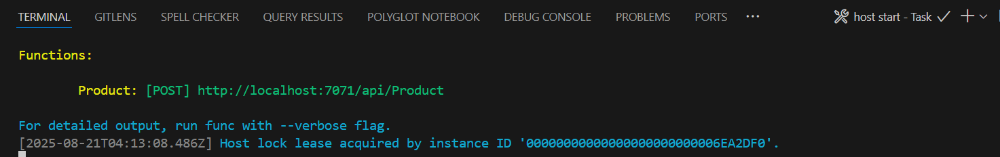
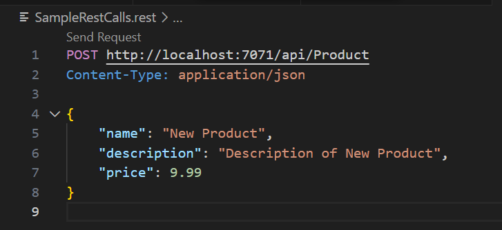

# Azure Integration Services Workshop

## End-to-End Integration Solution

Now that you have individual experience with APIM, Logic Apps, Functions and Service Bus. This lab will guide you through a scenario that combines all these skills together.

The scenario is a simplified new product announcement workflow for a fictitious application, where multiple Azure services work in concert:

- API Management: Exposes an "Product" API” to accept the new product. Azure Function (Product Intake): Receives the product submission, and places a 'new product' message on a Service Bus queue.
- Service Bus: Queues the 'new product' message to decouple and asynchronously process it.
- Logic App (Processor): Triggered by the queue message, it processes the new product (simulated by logging or transforming data) and then, for each Dynamics 365 Contact, queues an email message on a Service Bus queue.
- Logic App (Email): Triggered by the queue message, it sends out an email confirmation via Office 365 of the new product.

This integrated exercise will show how services can be used together to implement a cloud integration pattern. It mirrors real-world enterprise integration scenarios (for example, an HTTP API frontend feeding into a message-based workflow and using events to signal completion)

### Skill Objective: End-to-End Integration Solution

Learn to create an end-to-end Azure Integration Services solution that integrates multiple components.

## Guide Steps

### Step 0: Prerequisites

Before you get started, make sure you have the following requirements in place:

- An Azure account with an active subscription.

- [.NET 8.0 SDK](https://dotnet.microsoft.com/download/dotnet/8.0).

- [Visual Studio Code](https://code.visualstudio.com/) on one of the [supported platforms](https://code.visualstudio.com/docs/supporting/requirements#_platforms).

- [C# extension](https://marketplace.visualstudio.com/items?itemName=ms-dotnettools.csharp) for Visual Studio Code.  

- [Azure Functions extension](https://marketplace.visualstudio.com/items?itemName=ms-azuretools.vscode-azurefunctions) for Visual Studio Code.

- [REST Client](https://marketplace.visualstudio.com/items?itemName=humao.rest-client) extension for Visual Studio Code, to send HTTP request and view the response in Visual Studio Code directly. Alternatively, you may choose to use cURL or Postman.

#### Install or update Core Tools

The Azure Functions extension for Visual Studio Code integrates with Azure Functions Core Tools so that you can run and debug your functions locally in Visual Studio Code using the Azure Functions runtime. Before getting started, it's a good idea to install Core Tools locally or update an existing installation to use the latest version.

In Visual Studio Code, select F1 to open the command palette, and then search for and run the command **Azure Functions: Install or Update Core Tools**.

This command tries to either start a package-based installation of the latest version of Core Tools or update an existing package-based installation. If you don't have npm or Homebrew installed on your local computer, you must instead [manually install or update Core Tools](https://learn.microsoft.com/en-us/azure/azure-functions/functions-run-local#install-the-azure-functions-core-tools).

### Step 1: Azure Resources Setup

The first step is to ensure you have the following resources ready. If you created these in earlier exercises, then you can skip the creation.

#### API Management
<!-- markdownlint-disable-next-line MD033 -->
1. In the Azure portal, create a new API Management instance. Go to Create a resource > Integration > API Management. Fill in the basics (resource group, service name, region, organization name, admin email, pricing tier) and create the service. Please note that the **service name must be unique** across Azure, as it will be part of the public URL for your API Management instance (e.g., `https://<service-name>.azure-api.net`).

> The **Pricing tier** is important. For this lab, you can use the **Developer** tier, which is the cheapest and ideal for our hands-on lab. If you want to use the **Standard** or **Premium** tiers, please ensure you have the necessary permissions and budget.
<!-- markdownlint-disable-next-line MD028 -->
> API Management stv2 services can take ~30-60 minutes to deploy, so plan accordingly. Otherwise, using API Management v2 services will take much less time to deploy. However, as there is no **Developer** tier available for v2 services, you will need to use the **Basic** tier which is more expensive than the Developer stv2 tier.


>Please do not modify other settings. Specifically, the *Virtual network* tab should remain as **None**.


>Once started, it is not necessary to remain on this page or in the Azure Portal. If you entered a valid email address, you will receive a provisioning completion email:


#### Service Bus

1. In the Azure portal, create a Service Bus Namespace (search and select + Create for Service Bus). Choose a unique name and the region, and select the Standard tier.

1. Select **Review and create** at the bottom of the page.


<!-- markdownlint-disable-next-line MD029 -->
3. Once created, open the namespace. Now, you will need to create two queues in this namespace: under Entities in the namespace blade, select Queues and click + Queue.

1. Create two queues

- `product`
  - Provide a name for the queue (i.e., “product”) and leave defaults for max size etc., then press **Create**.
- `notification`
  - Provide a name for the queue (i.e., “notification”) and leave defaults for max size etc., then press **Create**.


#### Dynamics 365 instance with a Contact entity

This end-to-end labs assumes you have a Dynamics 365 instance with a Contact entity. If you do not have access to a Dynamics 365 instance, please follow the alternate steps when creating the workflow.

#### Office 365 account for sending emails

You will need an Office 365 account to send emails from the Logic App. If you do not have access to an Office 365 account, please follow the alternate steps when creating the workflow.

#### Service Bus access/permissions

The Logic Apps and Azure Functions connect to Service Bus. For simplicity, you can use shared access keys or managed identity. In a hands-on setting, using shared connection strings in the Logic App and a function output is straightforward.

### Step 2 : Implement New Product Azure Function (API backend)

We will implement a HTTP-triggered Azure Function that will handle the payload from Azure API Management. The function should be set to trigger on the HTTP POST verb. (Provide the connection string or use the ServiceBus connection setting, and queue name in Function configuration.) In the Function code, parse the product payload and perform a stub “processing” – for example, create a new globally unique product ID or perform any transformation. Then, as part of processing, have the function send a message to Service Bus. You can do this by using the Service Bus output binding (preferable), the Service Bus SDK, or by calling the Service Bus REST API.

1. Use Visual Studio Code to create a new local Azure Functions project in C#.

<!-- markdownlint-disable-next-line MD029 MD033 -->
2. In Visual Studio Code, press <kbd>F1</kbd> to open the command palette and search for and run the command `Azure Functions: Create New Project...`.

1. Select the directory location for your project workspace and choose **Select**. You should either create a new folder or choose an empty folder for the project workspace. Don't choose a project folder that is already part of a workspace.

1. Provide the following information at the prompts:

    |Prompt|Selection|
    |--|--|
    |**Select a language for your function project**|Choose `C#`.|
    | **Select a .NET runtime** | Choose `.NET 8.0 Isolated (LTS)`.|
    |**Select a template for your project's first function**|Choose `HTTP trigger`$^{1}$|
    |**Provide a function name**|Type `Product`.|
    |**Provide a namespace** | Type `My.Functions`. |
    |**Authorization level**|Choose `Anonymous`, which enables anyone to call your function endpoint. For more information, see [Authorization level](https://learn.microsoft.com/en-us/azure/azure-functions/functions-bindings-http-webhook-trigger?tabs=python-v2%2Cisolated-process%2Cnodejs-v4%2Cfunctionsv2&pivots=programming-language-csharp#http-auth).|
    |**Select how you would like to open your project**|Select `Open in current window`.|

    $^{1}$ Depending on your VS Code settings, you may need to use the `Change template filter` option to see the full list of templates.

1. Visual Studio Code uses the provided information and generates an Azure Functions project with an HTTP trigger. View the local project files in the Explorer view of Visual Studio Code.

1. In the **Explorer** panel, open the `Product.cs` file. This file contains the code for your function.

1. At the bottom of the `Product.cs` file, add the following code.

```csharp
public class Product
{
    [JsonPropertyName("id")]
    public string? Id { get; set; }
    [JsonPropertyName("name")]  
    [JsonRequired]
    public required string Name { get; set; }
    [JsonPropertyName("description")]
    [JsonRequired]
    public required string Description { get; set; }
    [JsonPropertyName("price")]
    [JsonRequired]
    public decimal Price { get; set; }
}

public class OutputType
{
    [ServiceBusOutput("product", Connection = "ServiceBusConnection")]
    public Product? OutputEvent { get; set; }

    [HttpResult]
    public required HttpResponseData HttpResponse { get; set; }
}
```
<!-- markdownlint-disable-next-line MD029 -->
8. Check your Azure Function logic performs the required “processing”. The Function code needs to ensure that it is set to trigger on the HTTP POST verb, a product has been supplied in the request body that it is valid, and ensure there is a product id present.

    **NOTE**: If you are unsure, you may use the following code. But please don't just copy and paste without understanding what this code does.
    - The `product` payload that is POSTed to the Azure Function is converted to a `Product` instance using the parameter decorator `[Microsoft.Azure.Functions.Worker.Http.FromBody]`
    - The output of the Function uses an `OutputType` class to encapsulate the response data for BOTH the HTTP response and writing the message into the Service Bus queue. Further reading can be found here: <!-- markdownlint-disable-next-line MD034 -->
    https://learn.microsoft.com/en-us/azure/azure-functions/functions-bindings-service-bus-output

```csharp
    [Function("Product")]
    public async Task<OutputType> NewProduct([HttpTrigger(AuthorizationLevel.Anonymous, "POST")] HttpRequestData req,
        FunctionContext executionContext,
        [Microsoft.Azure.Functions.Worker.Http.FromBody] Product product)
    {
        _logger.LogInformation("Product function processing a request.");
        HttpResponseData response = req.CreateResponse(HttpStatusCode.OK);
        
        if (product == null)
        {
            response.StatusCode = HttpStatusCode.BadRequest;
            await response.WriteStringAsync("Invalid product data.");
            return new OutputType()
            {
                HttpResponse = response
            };
        }
        if (string.IsNullOrEmpty(product.Id))
        {
            product.Id = Guid.NewGuid().ToString();
        }

        await response.WriteStringAsync("New product created successfully!");
        return new OutputType()
        {
            OutputEvent = product,
            HttpResponse = response
        };
    }
```

<!-- markdownlint-disable-next-line MD029 -->
9. In the Azure Portal, go to the Service Bus instance and retrieve the primary connection string for the `RootManageSharedAccessKey` shared access policy. This connection string is used to connect to the Service Bus queue from your Azure Function.

TODO: Add screenshot of how to get connection string

<!-- markdownlint-disable-next-line MD029 -->
10. Go to Visual Studio Code and open the **local.settings.json** file. Add the connection string to the file as follows:

```json
{
  "IsEncrypted": false,
  "Values": {
    "AzureWebJobsStorage": "UseDevelopmentStorage=true",
    "FUNCTIONS_WORKER_RUNTIME": "dotnet-isolated",
    "ServiceBusConnection": "<your_connection_string>"
  }
}
```

Replace `<your_connection_string>` with the Azure Service Bus connection string you just retrieved from the Azure Portal.

<!-- markdownlint-disable-next-line MD029 MD033 -->
11. Execute your function locally by pressing <kbd>F5</kbd> to start the function app project. The **Terminal** panel displays the output from Core Tools. Your app starts in the **Terminal** panel. You can see the URL endpoint of your HTTP-triggered function running locally.



<!-- markdownlint-disable-next-line MD029 -->
12. Create a new file called `SampleRestCalls.rest` in the root of your project. Place the following content into the file, and save the file.

```json
POST http://localhost:7071/api/Product
Content-Type: application/json

{
    "name": "New Product",
    "description": "Description of New Product",
    "price": 9.99
}
```

The file will look like the following.



<!-- markdownlint-disable-next-line MD029 -->
13. Click on the `Send Request` text to send the HTTP request to the locally running Function. The response from the Function will be displayed in a new **Response** panel. The terminal window will show the execution output. The Response panel will show the following information; hopefully, the message in the last line says that a new product was created successfully.

```text
HTTP/1.1 200 OK
Connection: close
Date: Thu, 21 Aug 2025 04:57:58 GMT
Server: Kestrel
Transfer-Encoding: chunked

New product created successfully!
```

<!-- markdownlint-disable-next-line MD029 MD033 -->
14. Press <kbd>Ctrl + C</kbd> in the terminal window to stop Core Tools and disconnect the debugger. It's time to use Visual Studio Code to publish the project directly to Azure.
<!-- markdownlint-disable-next-line MD029 -->
15. Sign in to Azure so you can create Azure resources or publish your app. If you aren't already signed in, in the **Activity bar**, select the Azure icon. Then under **Resources**, select **Sign in to Azure**.


If you're already signed in and can see your existing subscriptions, go to the next step.

When you are prompted in the browser, select your Azure account and sign in by using your Azure account credentials. If you create a new account, you can sign in after your account is created. After you successfully sign in, you can close the new browser window. The subscriptions that belong to your Azure account are displayed in the side bar.

<!-- markdownlint-disable-next-line MD029 -->
16. Now, let's create the function app in Azure in a Flex Consumption plan. In Visual Studio Code, select F1 to open the command palette. At the prompt (`>`), enter and then select **Azure Functions: Create Function App in Azure**.

1. At the prompts, provide the following information:

    |Prompt|Action|
    |--|--|
    |**Select subscription**| Select the Azure subscription to use. The prompt doesn't appear when you have only one subscription visible under **Resources**. |
    |**Enter a new function app name**| Enter a globally unique name that's valid in a URL path. The name you enter is validated to make sure that it's unique in Azure Functions. |
    |**Select a location for new resources**| Select an Azure region. For better performance, select a [region](https://azure.microsoft.com/regions/) near you. Only regions supported by Flex Consumption plans are displayed. |
    |**Select a runtime stack**| Select the .Net 8.0 runtime stack. |
    | **Select resource authentication type** | Select **Managed identity**, which is the most secure option for connecting to the [default host storage account](https://learn.microsoft.com/en-us/azure/azure-functions/storage-considerations?tabs=azure-cli#storage-account-guidance). |

1. When the function app is created, the following related resources are created in your Azure subscription. The resources are named based on the name you entered for your function app.

- A resource group, which is a logical container for related resources.
- A function app, which provides the environment for executing your function code. A function app lets you group functions as a logical unit for easier management, deployment, and sharing of resources within the same hosting plan.
- An Azure App Service plan, which defines the underlying host for your function app.
- A standard Azure Storage account, which is used by the Functions host to maintain state and other information about your function app.
- An Application Insights instance that's connected to the function app, and which tracks the use of your functions in the app.
- A user-assigned managed identity that's added to the [Storage Blob Data Contributor](https://learn.microsoft.com/en-us/azure/role-based-access-control/built-in-roles/storage#storage-blob-data-contributor) role in the new default host storage account.

A notification is displayed after your function app is created and the deployment package is applied.

<!-- markdownlint-disable-next-line MD029 -->
19. Now, let's deploy the project to Azure. In the command palette, enter and then select **Azure Functions: Deploy to Function App**.  

> IMPORTANT: Deploying to an existing function app always overwrites the contents of that app in Azure.

- Select the function app you just created. When prompted about overwriting previous deployments, select **Deploy** to deploy your function code to the new function app resource.
- When deployment is completed, select **View Output** to view the creation and deployment results, including the Azure resources that you created. If you miss the notification, select the bell icon in the lower-right corner to see it again.

<!-- markdownlint-disable-next-line MD029 -->
20. The **ServiceBusConnection** application setting needs to be added to the function app. 

- In the Azure portal, navigate to your function app.
- Under **Settings**, select **Environment variables**.
- Select **+ Add** and add a new setting with the name `ServiceBusConnection` and the value set to the Service Bus connection string you retrieved earlier. Leave the **Deployment slot setting** unchecked.
- Click **Apply** at the bottom of the page.

### Step 3 : Expose Azure Function via API Management

The API Management instance will safely expose the "Product" API” to accept the new product.

In your API Management instance, create a new API by importing the Function App. APIM can directly import a Function app as an API.

1. Go to APIs > + Add API > Function App. Browse and select the Function App you just built in Step 2, and name this API “Product API” and assign it a suffix like “product”. APIM will import the HTTP trigger as an operation in a new API (it auto-generates the OpenAPI definition).
1. Once imported, you can see the operation – you can rename it to “NewProduct”. Now, developers/apps could call this via APIM’s endpoint (which is friendlier and governed by APIM policies).
1. Create a new APIM product called `Product`, and add the "Product API" into its list of available APIs
1. Create a APIM subscription called `ProductSubscription` for the `Product` product. Obtain the primary subscription key, and copy it into your paste buffer (Ctrl+C)
1. Go to Visual Studio Code and open the `SampleRestCalls.rest` file, and add the following to the end of the file. The three hashes indicate a new section, and there is a line **before** and **after** these hashes.

```json

###

POST https://<your-apim>.azure-api.net/product
Content-Type: application/json
Ocp-Apim-Subscription-Key: <your-apim-subscription-key>

{
    "name": "New Product",
    "description": "Description of New Product",
    "price": 9.99
}
```

<!-- markdownlint-disable-next-line MD029 -->
6. Change the `<your-apim>` placeholder to the name of your API Management instance.
1. Change the `<your-apim-subscription-key>` placeholder to the primary subscription key you obtained earlier in Step 4.
1. Click on the `Send Request` text above this HTTP request. The response from API Management will be displayed in a new **Response** panel. The Response panel will show the following information; hopefully, the message in the last line says that a new product was created successfully.

```text
HTTP/1.1 200 OK
Connection: close
Date: Thu, 21 Aug 2025 04:57:58 GMT
Server: Kestrel
Transfer-Encoding: chunked

New product created successfully!
```

### Step 4 : New Product Logic App

1. In the Azure Portal, create a new Logic App (Consumption) named “NewProductLogicApp”. This logic app will handle the new product requests.
1. Under Settings, go to the Identity settings and enable the **System assigned** managed identity.
1. Now we need to assign the necessary permissions to the managed identity of the Logic App to access the Service Bus. So, navigate to the **Service Bus Namespace** in the Azure Portal.
    - Click on **Access control (IAM)**
    - Click on the down facing carat **v** next to the **+ Add** button
    - Select **Add role assignment**
    - Search for the **Azure Service Bus Data Owner** role. Select it, and then press **Next**
    - Assign the access to a **Managed identity**, and then select the Logic App's managed identity from the list that will appear when you click on **+ Select members**.
    - Click **Review + assign** twice.
1. In the Logic App designer, add a **When a message is received in a queue (auto-complete) trigger**. It will prompt you to create a connection;
    - Provide a meaningful connection name, e.g. `connectionServiceBus`
    - Use **Logic Apps Managed Identity** as the authentication type
    - Provide the Service Bus Namespace endpoint to the Service Bus you created earlier, in the form of 'sb://<your_service_bus>.servicebus.windows.net/'
    - Click on **Create new**
    - Select the `product` queue you created earlier.
1. Add a **Parse JSON** action to parse the incoming message. Use the output from the Service Bus trigger as the content. You can use the following sample payload to generate the schema:

```json
{
    "id": "12345",
    "name": "New Product",
    "description": "Description of New Product",
    "price": 9.99
}
```
<!-- markdownlint-disable-next-line MD029 -->
6. Add a **Get items from an entity** action to retrieve Contacts from Dynamics 365. Configure the connection to your Dynamics 365 instance and select the Contact entity. This will fetch all contacts.

> If you do not have access to a Dynamics 365 instance, then perform the alternate steps a little further below.

<!-- markdownlint-disable-next-line MD029 -->
7. Next, add a **For each** Control action. Select the **value** array from the output of the previous action as the input.
1. Inside the For each action
    1. Add a **Compose** action to create the email message. Use the following as the **Inputs**.

    ```json
    {
      "to": "@{items('For_each')?['emailaddress1']}",
      "subject": "New Product Confirmation - @{body('Parse_JSON')?['name']}",
      "body": "Dear @{items('For_each')?['firstname']}, A new product has been received...",
      "productId": "@{body('Parse_JSON')?['id']}",
      "customerName": "@{items('For_each')?['firstname']} @{items('For_each')?['lastname']}"
    }
    ```
    <!-- markdownlint-disable-next-line MD029 -->
    2. Add a **Service Bus** action to send a message to the Service Bus "notification" queue. Use the connection created earlier, and select the `notification` queue. Under Advanced parameters, select Content. Then in the Content box, use the output from the Compose action.

1. Save the Logic App.

#### Alternate Steps

If you do not have access to a Dynamics 365 instance, you can follow these steps.

1. **Add an Initialize Variable Action** as an action immediately after the Parse JSON action
   - Name: `varContacts`
   - Type: Array
   - Value:

```json
[
  {
    "firstname": "john",
    "lastname": "billiris",
    "emailaddress1": "john@thebestcompany.com"
  },
  {
    "firstname": "anna",
    "lastname": "smith",
    "emailaddress1": "anna@thebestcompany.com"
  }
]
```
<!-- markdownlint-disable-next-line MD029 -->
2. **Add For Each Loop** after the "Initialize variables" action
    - Output From Previous Steps: `"@variables('varContacts')`

1. Add a **Compose** action to create the email message. Use the following as the **Inputs**.

    ```json
    {
      "to": "@{items('For_each')?['emailaddress1']}",
      "subject": "New Product Confirmation - @{body('Parse_JSON')?['name']}",
      "body": "Dear @{items('For_each')?['firstname']}, A new product has been received...",
      "productId": "@{body('Parse_JSON')?['id']}",
      "customerName": "@{items('For_each')?['firstname']} @{items('For_each')?['lastname']}"
    }
    ```

<!-- markdownlint-disable-next-line MD029 -->
4. Add a **Service Bus** action to send a message to the Service Bus "notification" queue. Use the connection created earlier, and select the `notification` queue. Under Advanced parameters, select Content. Then in the Content box, use the output from the Compose action.

1. Save the Logic App.

### Step 5 : Notification Logic App

Now we will create a second Logic App that will handle sending email notifications based on the messages placed in the Service Bus queue by the first Logic App.

1. In the Azure Portal, create a new Logic App (Consumption) named “NotificationLogicApp”. This logic app will handle taking the message from the Service Bus queue and sending an email notification.
1. Under Settings, go to the Identity settings and enable the **System assigned** managed identity.
1. Now we need to assign the necessary permissions to the managed identity of the Logic App to access the Service Bus. So, navigate to the **Service Bus Namespace** in the Azure Portal.
    - Click on **Access control (IAM)**
    - Click on the down facing carat **v** next to the **+ Add** button
    - Select **Add role assignment**
    - Search for the **Azure Service Bus Data Owner** role. Select it, and then press **Next**
    - Assign the access to a **Managed identity**, and then select the Logic App's managed identity from the list that will appear when you click on **+ Select members**.
    - Click **Review + assign** twice.
1. In the Logic App designer, add a **When a message is received in a queue (auto-complete) trigger**. This time, you will not be prompted to create a connection as it will use the existing connection.
    - Select the `notification` queue you created earlier.
1. Add a **Parse JSON** action to parse the incoming message. Use the output from the Service Bus trigger as the content. You can use the following schema:

```json
{
    "type": "object",
    "properties": {
        "to": {
            "type": "string"
        },
        "subject": {
            "type": "string"
        },
        "body": {
            "type": "string"
        },
        "productId": {
            "type": "string"
        },
        "customerName": {
            "type": "string"
        }
    }
}
```
<!-- markdownlint-disable-next-line MD029 -->
6. Add a **Send an email (V2)** action from Office 365 Outlook to send an email to the contact. It will prompt you to sign in.
    - Use the email address from the output of the Parse JSON action for the **To** field
    - Use the subject from the output of the Parse JSON action as the subject
    - For the email body, include details about the new product (you can use dynamic content from the Service Bus message).

> If you do not have access to an Office 365 Outlook instance, you can use a personal email account to send the email. You can choose not perform this step (no emails will be sent, but notifications will still be enqueued in the Service Bus queue).

<!-- markdownlint-disable-next-line MD029 -->
7. Save the Logic App.

### Step 6

Test End-to-End Flow – Time to see everything in action. Use either API Management’s Test console, REST Client in Visual Studio Code, or a tool like cURL/Postman to call the Product API endpoint (the APIM gateway URL) with a sample product JSON.

Through APIM, the request goes to the New Product Function (Step 2) which puts the message on the Service Bus queue (Step 3). Check the Service Bus queue in the Azure portal – the message count should increment and then decrement shortly after as the Notification Logic App picks it up.

The New Product Logic App (Step 4) will be triggered by the queue message; verify its run history to ensure it processed the message and a message is enqueued to the "notifications" queue.

Next, the Notification Logic App (Step 5) should trigger on that message. Check its run history – it should show a successful run triggered by the event, and the email action completed. Finally, confirm the notification (i.e., the confirmation email was received).

## Conclusion

You have now built and tested an integrated solution using several Azure Integration Services components together. This lab demonstrated how an API call can initiate an Azure Function, to write to Service Bus, with Logic Apps interacting with downstream external systems. Such patterns (API + queue + events) are common in real systems to achieve reliability and scalability. We used APIM for a consistent interface, Logic Apps for orchestration, Service Bus for decoupling and buffering, and Azure Functions for custom logic – aligning with the workshop’s objectives to “integrate, scale and monitor applications using Azure services like APIM, Logic Apps, Service Bus, Azure Functions”.

**Congratulations on completing the end-to-end lab!**
