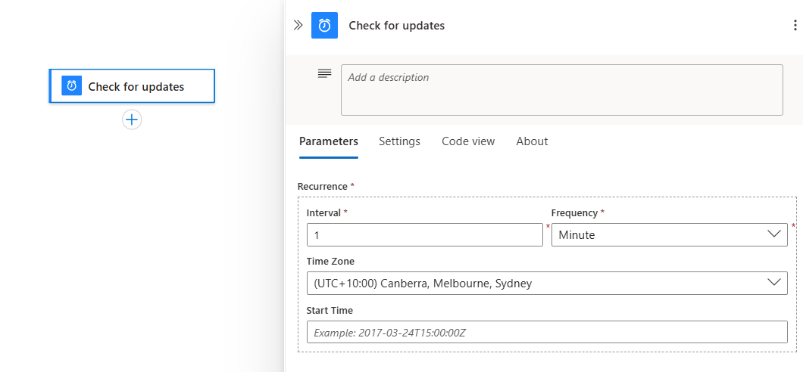
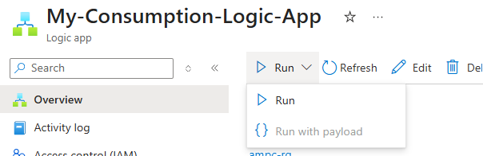
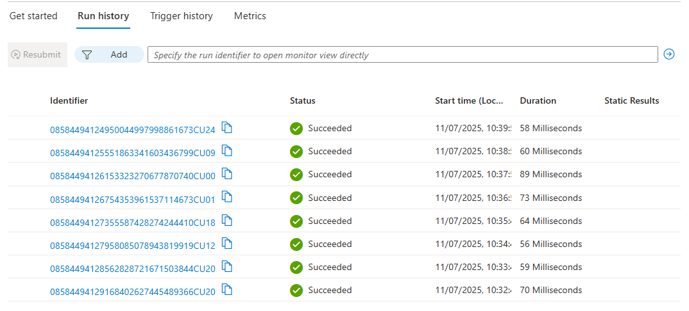
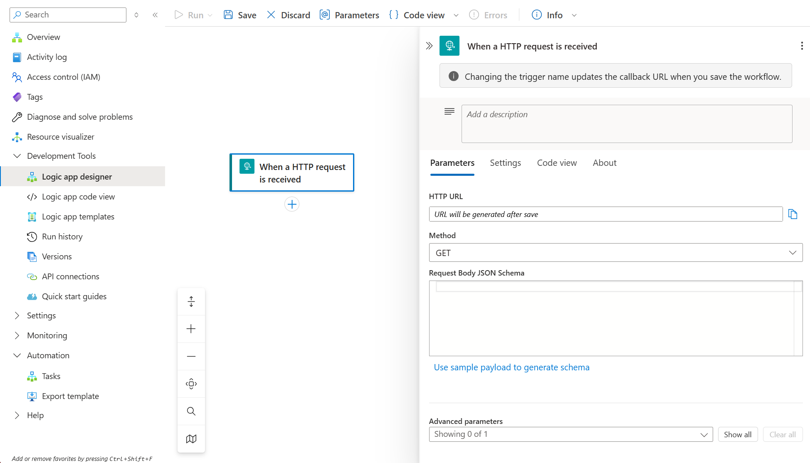
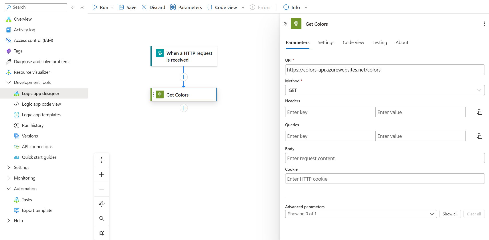
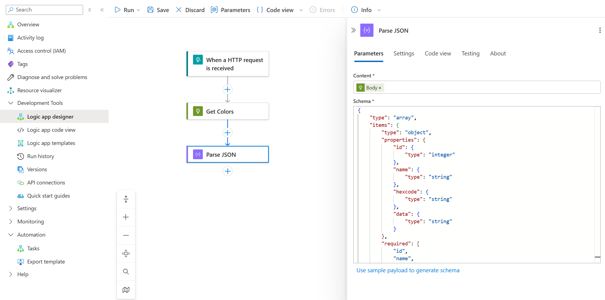
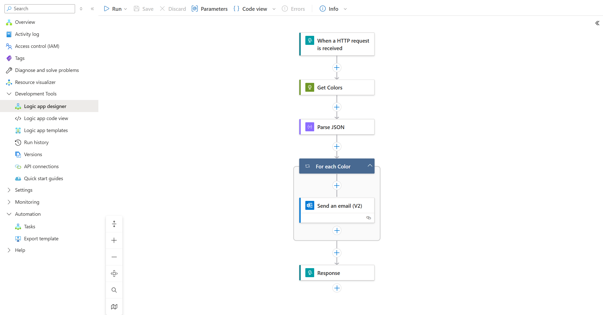

# Azure Integration Services Workshop

## Azure Logic Apps – Hands-On Guide

Azure Logic Apps enable you to orchestrate workflows that integrate various services without writing code. In this guide, you will create two Logic Apps; one that triggers on a schedule and performs an action, and the other which receives a HTTP request, retrieves external data, and processes it. These teach the core concepts of triggers and actions in Logic Apps.

### Skill Objective: Logic Apps

Learn to build an automated workflow with a trigger and actions. This includes configuring a trigger (event or schedule) and adding steps such as sending an email or calling an API in a logic app.

## Guide Steps

### Step 1

Create a Logic App Resource – In the Azure portal, create a new Logic App (Consumption plan) resource. (Search for "Logic App" and select Add).


Choose the Consumption plan for a simple scenario. Provide a name and resource group, then create the logic app. Your settings should look similar to the following example.


Once deployed, navigate to the Logic App designer.


### Step 2

Define a Trigger – Every logic app starts with a trigger that fires the workflow. In the designer, select a trigger.

1. On the workflow designer, [follow these general steps to add the **Schedule** trigger named **Recurrence**](create-workflow-with-trigger-or-action.md?tabs=consumption#add-trigger).
1. Rename the **Recurrence** trigger with the following title: **Check for updates**.



3. In the trigger information box, provide the following information:

   | Parameter | Value | Description |
   |-----------|-------|-------------|
   | **Interval** | 1 | The number of intervals to wait between checks |
   | **Frequency** | Minute | The unit of time to use for the recurrence |

1. Save your workflow. On the designer toolbar, select **Save**.

Your logic app resource and updated workflow are now live in the Azure portal. However, the workflow only triggers based on the specified schedule and doesn't perform other actions. So, add an action that responds when the trigger fires.

### Step 3

Add an Action – After the trigger, add actions that the logic app will perform.

Let’s have the logic app send an email for each run (simulating an alert).

1. Click **+** and add an action.
1. Select the Office 365 Outlook Send an email action (you’ll be prompted to sign in to an Outlook or Office 365 account).
1. Configure the email recipient, subject, and body. You can use outputs from previous steps in later actions; in our simple case, just put a static message like “Logic App run at @{utcNow()}” to include a timestamp. This demonstrates using connectors – here the Outlook connector – to perform work.

Note: If you don’t have an Office 365 account, you could choose an alternative action such as a Teams message or writing to an Azure Storage for the sake of practice. The key is to integrate at least one external service in the workflow. Each action you add uses a connector under the hood to talk to that service. (Logic Apps has 1000+ connectors for various services).

### Step 4

Save and Run – Click Save to deploy the workflow. For a Recurrence trigger, the Logic App will run automatically on schedule.

You can also trigger it manually for testing: on the designer toolbar, use Run > Run.



Check the Runs history in the Logic App overview — you should see a successful run entry. Clicking on it will show a timeline of steps: the trigger and the email action. If the action succeeded, verify that the email was sent (check the inbox of the configured recipient). Each run’s details confirm that the workflow executed as designed.



### Step 5

Let's create a more advanced Logic App Resource that responds to a HTTP trigger, calls an external API, and processes the response.

1. In the Azure portal, create a new Logic App (Consumption plan) resource. (Like earlier, search for "Logic App" and select Add).
1. Choose the Consumption plan. Select your resource group, provide a name and select a region.
1. Click on **Review + create**. Wait for the validation to complete, and then click on **Create**
1. Once deployed, navigate to the Logic App designer.
1. On the sidebar menu, under Development Tools, select the designer to open your blank workflow.
1. Add the Request built-in trigger named When a HTTP request is received to your workflow by following the general steps to add a trigger
   [here](https://learn.microsoft.com/en-us/azure/logic-apps/add-trigger-action-workflow?tabs=consumption#add-trigger).
1. In the trigger information box, provide the following information:

   | Parameter | Value | Description |
   |-----------|-------|-------------|
   | **HTTP URL** | (leave blank) | The endpoint URL that's generated after you save your workflow and is used for sending a request that triggers your workflow. |
   | **Method** | Get | Only the GET HTTP verb will be used to trigger this workflow. |

At this point, the workflow designer will look similar to the following example.


8. Add an Action by clicking **+** which is located underneath the trigger, and then clicking on **add an action**.
1. Select the HTTP action by selecting the **Built-in** tab, then selecting **HTTP**, and then selecting the **HTTP** action.
1. Configure the HTTP action to call the Colors API external API by using the following settings:
   - **Method**: GET
   - **URI**: https://colors-api.azurewebsites.net/api/colors
1. Change the name of the action to **Get Colors** by clicking on the action name, currently set to **HTTP** and typing the new name of **Get Colors**.
At this stage, your workflow should look similar to the following example.


1. Add a **Parse JSON** action to parse the response from the Colors API. Click **+**, search for **Parse JSON**, and select it.
1. Configure the Parse JSON action with the following settings:
   - **Content**: Select the Body from the HTTP action (this is the response content). In the Content box, click on the dynamic content icon (which appears as a lightning bolt icon) and select **Body** under the **Get Colors** action.
   - **Schema**: Use the following schema to parse the response:

```json
{
    "type": "array",
    "items": {
        "type": "object",
        "properties": {
            "id": {
                "type": "integer"
            },
            "name": {
                "type": "string"
            },
            "hexcode": {
                "type": "string"
            },
            "data": {
                "type": "string"
            }
        },
        "required": [
            "id",
            "name",
            "hexcode",
            "data"
        ]
    }
}
```

At this stage, your workflow should look similar to the following example.


14. Add a **For each** action to parse the response from the Colors API. Click **+**, search for **For each**, and select it.
1. Configure the **For each action**, and in the **Select An Output From Previous Steps** box, click on the dynamic content icon (which appears as a lightning bolt icon) and select **Body** under the **Parse JSON** action.
1. Change the name of the action to **For each Color** by clicking on the action name, currently set to **For each** and typing the new name of **For each Color**.
1. Follow the steps provided in Step 3 to add an action *inside* the **For each Color** action to send an email for each color. Configure it with the following settings:
   - **To**: Your email address
   - **Subject**: "Color Information at @{utcNow()}"
   - **Body**: Use dynamic content to include the color name and hex code, such as "Color Name: @{items('For_each_Color')?['name']}, Hex Code: @{items('For_each_Color')?['hexcode']}"
1. Add a **Response** action after the **For each Color** action to send a response back to the calling application. Click **+**, search for **Response**, and select it. Use the following settings:
   - **Status Code**: 200
   - **Body**: Use the dynamic content to include the body of the **Get Colors** action, such as "@{body('Get_Colors')}"
1. Save your workflow. On the designer toolbar, select **Save**.

At this point, your workflow should look similar to the following example.


20. Manually trigger the Logic App for testing: on the designer toolbar, use Run > Run.
1. View the Run history to see the successful run entry. Clicking on it will show a timeline of steps: the trigger, the HTTP action, the Parse JSON action, the For each action, and the Response action. If all actions succeeded, verify that you received an email for each color with the details.

## Conclusion

You have now created a logic app that periodically performs a task (sending an email). This exercise showcased how to configure a trigger (schedule) and add actions using connectors (Outlook email). Through hands-on practice, you learned how Logic Apps enable integration of services (like RSS to email, database to Teams, etc.) by configuring steps in a visual workflow, with no custom code needed.
